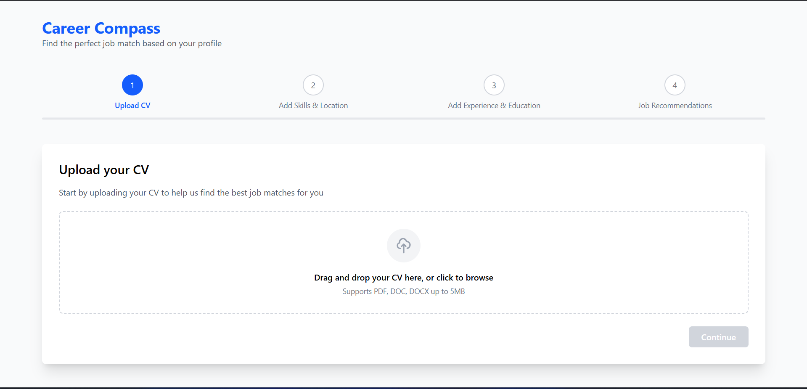
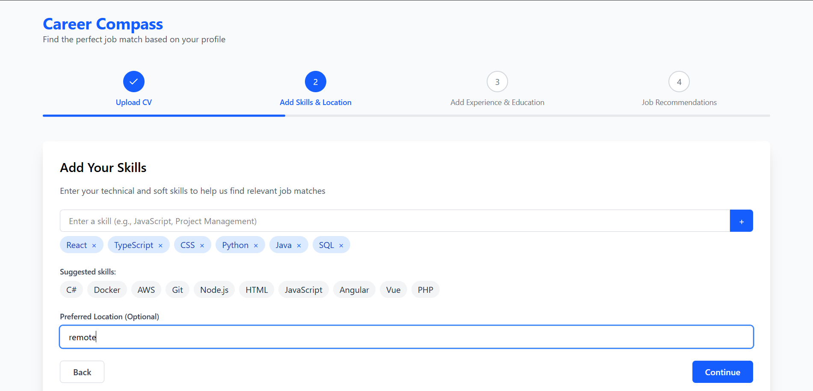
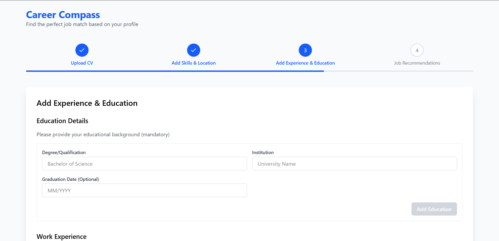
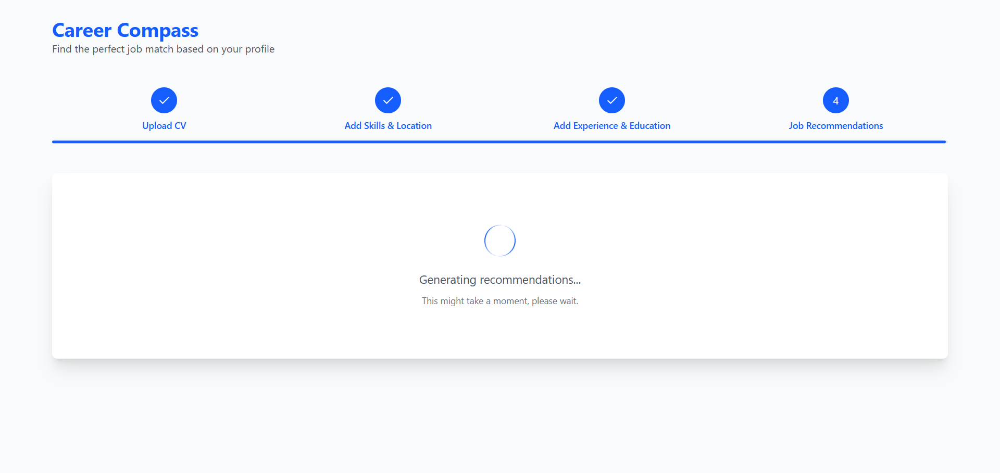
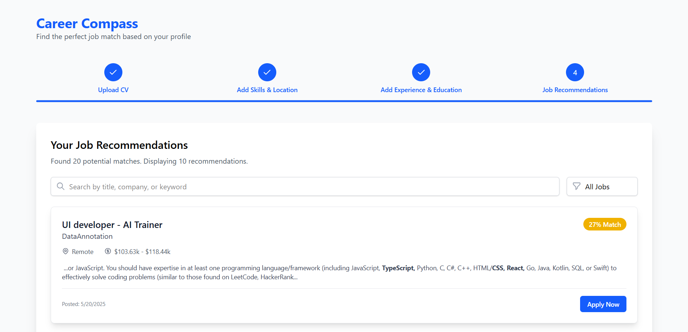
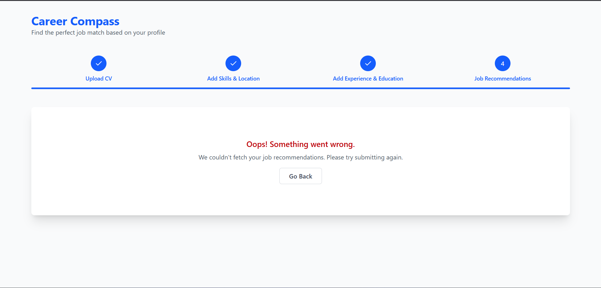
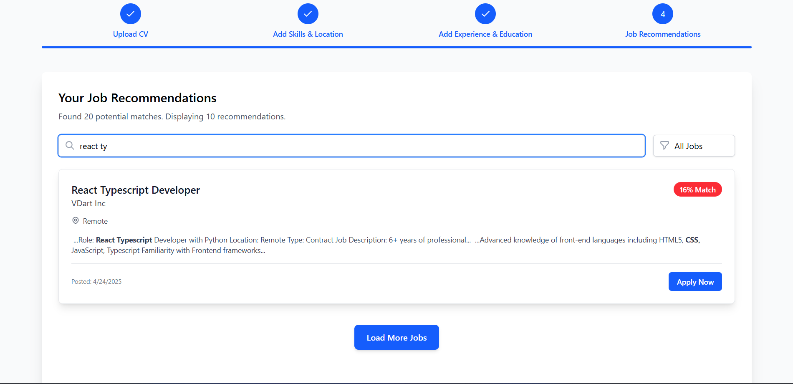

# 🌐 AI Job Recommendation System – Frontend

This is the frontend of the AI Job Recommendation System built using **React**, **TypeScript**, and **Tailwind CSS**. It connects to a FastAPI backend and provides a user-friendly interface for job seekers to get AI-powered job recommendations, upload their CVs, and manage their profiles.

## 🛠️ Tech Stack

- ⚛️ React (with Vite)
- 💅 Tailwind CSS
- 🔤 TypeScript
- 🐳 Docker
- 📡 Connects to FastAPI backend

## 🎯 Features

- ✨ Responsive and clean UI using Tailwind CSS
- 📄 CV Upload to AWS S3 (via backend)
- 🧠 Job Recommendations via LLM (from backend)
- 🔁 Paginated job listing (10 jobs per page)
- 👤 User profile view with all related info

## 📁 Project Structure

frontend/
├── public/
│ └── index.html
├── src/
│ ├── components/ # Reusable UI components
│ ├── pages/ # Page-level components
│ ├── services/ # API calls
│ ├── types/ # TypeScript interfaces/types
│ ├── App.tsx
│ ├── main.tsx
│ └── index.css
├── tailwind.config.js
├── Dockerfile
├── tsconfig.json
├── vite.config.ts
└── README.md

## 📸 UI Preview

### 🏠 Homepage


### 📄 CV Upload Page


### 🧠 Skills Page


### 💼 Experience Page

(public/4.png)

### ⏳ Loading Page


### 🤖 Job Recommendation Page


### ❌ Error Pages (404 / Server Error)


### 🔍 Job Search Page


## 📦 Getting Started

### Prerequisites

- Node.js (v18+ recommended)
- npm or yarn
- Docker (optional)

### Installation

```bash
git clone https://github.com/your-username/ai-job-frontend.git
cd ai-job-frontend
npm install
npm run dev
Configure Environment
Create a .env file in the root with the backend URL:
VITE_API_BASE_URL=http://localhost:8000

🐳 Docker Setup
Build and run the frontend in a Docker container:

docker build -t ai-job-frontend .
docker run -d -p 5173:5173 --env-file .env ai-job-frontend
📂 Available Scripts
npm run dev       
npm run build     
npm run preview   

🧠 Backend API Integration
Make sure your backend (FastAPI) is running and accessible at the URL defined in .env. All frontend API calls are made to this base URL.

✨ Styling
Tailwind CSS is used for consistent and responsive design. Utility classes are used throughout the components for layout and styling.

🤝 Contributing
Pull requests are welcome. For major changes, please open an issue first.

© 2025 Anushka Eshan | All rights reserved.